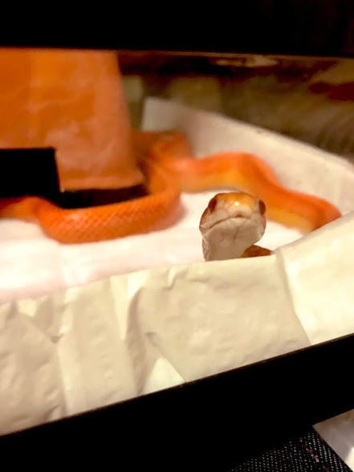
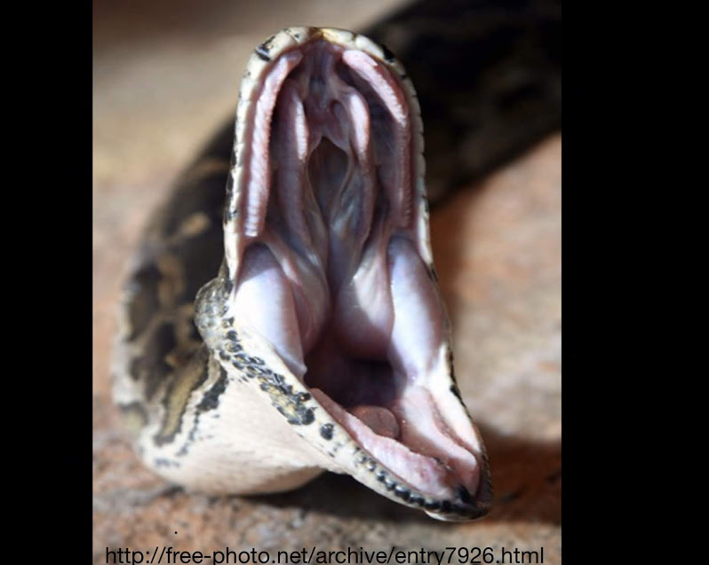
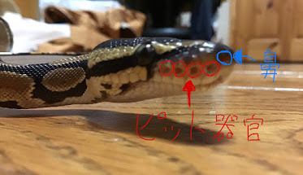

顔がカッコよく、触り心地が良い、色々な柄や色、種類によって癖や特徴があるなどあげだしたらキリがありません。（＾＾）
 
## ” その中でも今回は「見た目」について語ろうと思います。”
口元が少し開いているように見えて、周りの様子を調べるために舌をチロチロと出す姿があざと可愛いですね。
 

 

 
この可愛さに反して、豪快さ、カッコ良さもあります。
 
餌を食べるときに口を大きくして食べる姿は見惚れてしまいますね。
 
" 実はヘビが顎を外して食べるというのは嘘 "で実際には顎の構造に秘密があるのです。
 
ヘビの下顎は左右に分裂していて別々に動かすことができ、上顎も頭に固定されているわけではいないので必要に応じて前後に動かすことができるのです。
 
そのため、口の開口角度を大きくすることができて、自分よりも大きい餌を食べることができるのです。
 

 
目に見える大きな特徴といえば"ピット器官"があります。
 

 
では、"ピット器官とは何なのか？"
 
ヘビには自身の周りを調べるための感覚器官が４つあります。
 
## 1.視覚
* ヘビに瞼はなく、ウロコが変化した透明な眼鏡板といわれるものに覆われています。目はあまり良くなく、見えている色を見分けることが出来なかったりします。
## 2.聴覚
* ヘビの耳は見た目からは見えない内耳と呼ばれる内部器官があり、皮膚に当たる空気の振動を筋肉や骨を通じて音と認識します
## 3.皮膚感覚
* 上記の通り目や耳があまり良くないので皮膚の感覚が発達しているため、人やネズミの歩く振動を肌で感じることができます。
## 4.舌と鼻
* 目や耳があまり良くない代わりに、舌と鼻をつかって空気中の震動や匂い、味をとらえて周囲の状況を判断しています。
 
それに加えて”ピット器官”と呼ばれるものがあります。
 
目と鼻の間にある熱を感知する器官のことで、これはわずかな熱でも感知することができ、距離も測定することができるため軍用機器並に高性能と言われるほど優れています。
 
また、数十センチ離れたものの温度変化を0.1℃単位で知ることができます。
 
この器官は、ニシキヘビ科やマムシ科などの一部のヘビのみがもっています。
