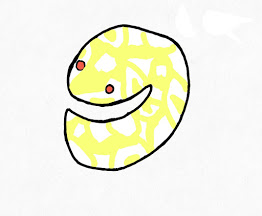
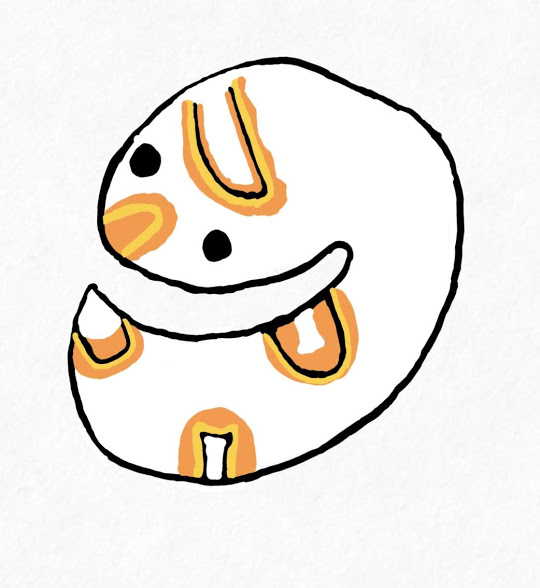
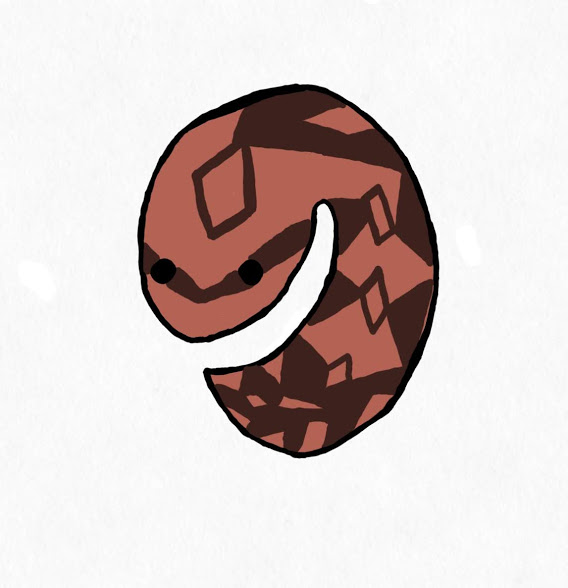
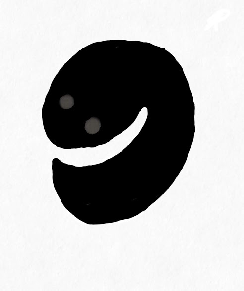
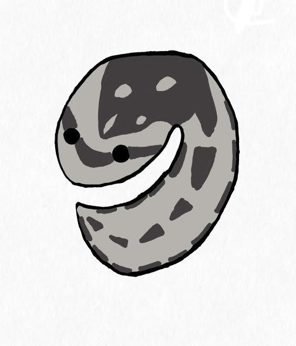
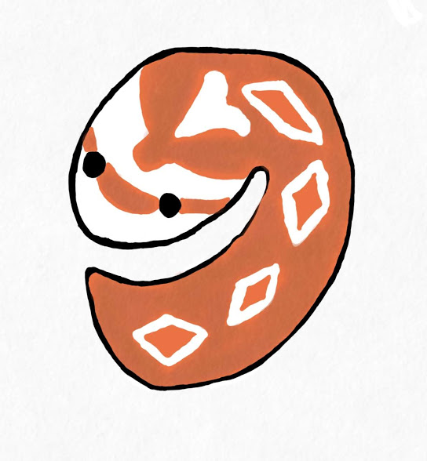
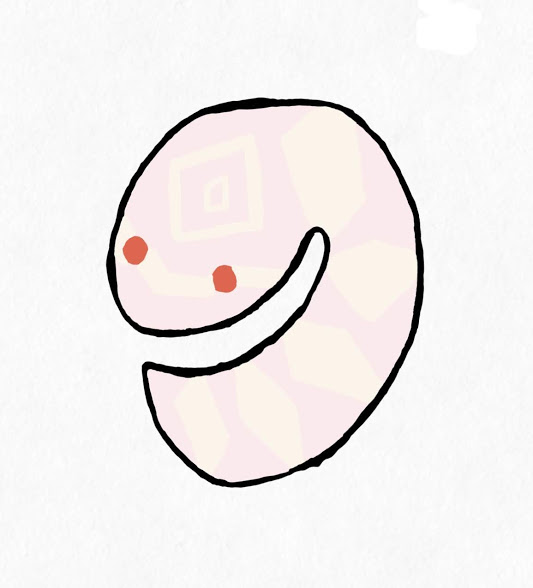
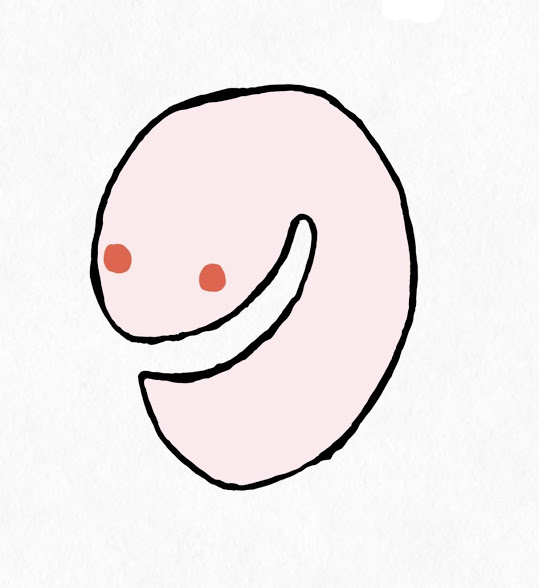

モルフとは簡単に言うと、その個体の柄や色のことを指します。
 
ここでは、基本的なモルフとそのそもモルフとは何なのかについてお話します！
 
## モルフとは
爬虫類は同じ種類でも個体によって体色や柄、模様が全然違います。
 
モルフとは、その**体色、模様の表現が確立された品種の事**をいいます。
これらは、人の手によって品種改良が繰り返されて出来上がったものもあり、野生個体の中で特徴的な柄を持った個体同士を掛け合わせたり、異なるモルフを掛け合わせて全く新しい体色、模様を出すことでモルフは作られていきます。
 
## 色彩について
両爬の色彩は、単純に４種類の色素から作られています。
黄色の色素・赤色の色素・虹色（青色）の色素・黒色の色素の４つです。
そのため、緑色を出すには、「 黄色 + 青色 = 緑色 」となるのです。
 
## 基本的なモルフについて
今回は基礎となるモルフについて紹介したいと思います。
※今回紹介するモルフ以外にも数多くのモルフがあるので後々紹介していきます！

### アメラニスティック/アルビノ (Amelanistic/Albino)

よくアルビノと言われているが正確にはアメラニスティックと言い、基本的には「黒色色素」が抜けている個体を指す場合が多いのだが、すべての色素がない個体を指す場合もあります。
また、何らかの色素が抜けているもの全体をまとめて指す場合もあります。
目の「虹彩」の色素もないので、血管の色が透けて目が赤くなるのが特徴です。
 
### リューシスティック (Leucistic)

模様が全くない個体で、基本的には全身白色になります。
ただし、色素自体はあるので目は黒色となります。
この中に「**パイボール（Piebald）**」も含まれます。
 

 
これは、体の一部分だけが不規則に白くなるものを言います。
 
### ハイポメラニスティック（Hypomelanistic）

「黒色色素」がない個体を指します。アルビノに似ていますが目は黒色で、体色に赤みが強い場合が多いです。
 
### メラニスティック（Melanistic）

「黒色色素」が多くなるパターンで、全身が黒色のものを言います。
 
### アネリスリスティック（Anerithristic）

「赤色色素」が少ないパターンを言い、鮮やかな色素がないためモノトーン風になります。
別名、ブラックアルビノ とも言われています。
 
### ザンティック（Xanthic）

青を示す「虹色素」が少ないパターンで、黄色が強く表れた個体を指します。
 
### アザンティック（Axanthic）
「黄色色素」が抜けたパターンで、赤色個体がピンクや紫になったり、
緑色個体が青色になったりします。
 
## 透明鱗
鱗が透明になっていて皮膚が透けている個体のことを言います。
 
よく使われているのが、スノーとブリザードです。
 
### スノー（Snow）

アルビノやリューシスティックで、模様が残っているものを指します。
 
### ブリザード（Blizzard）

アルビノやリューシスティックで、模様のないものを指します。
 
 
いかがだったでしょうか。好みの子や良いと思う個体は見つけられたでしょうか。
 
今日お話したモルフ以外にも、もっとたくさんのモルフがいるので
 
ぜひお気に入りの子を見つけてみてください。
 
また、他にモルフはどんなのがあるの？ ショップさんとお話したいけど、専門用語が分からない。という方は多いと思います。
 
そのことについても後々お話しますので、また見てくださると嬉しいです！
 
それでは〜