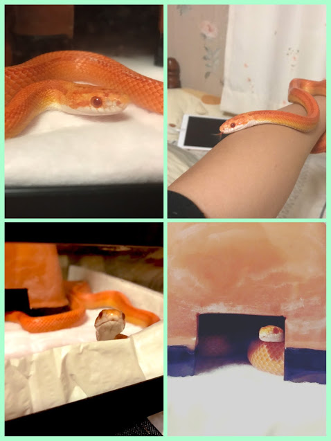
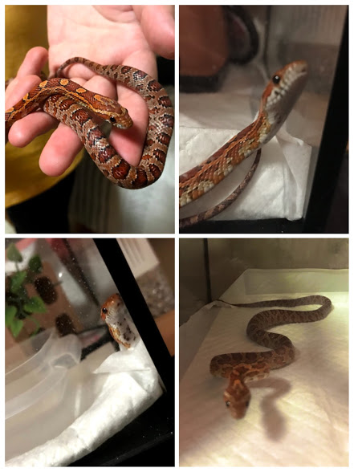
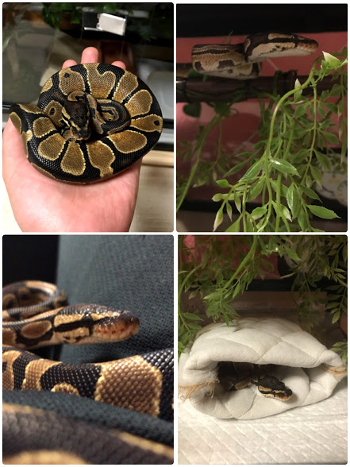

紹介が遅くなりましたが、我が家のヘビちゃん達を紹介したいと思います！
 
まだまだ３匹と少ないですが、良ければ見てくださると嬉しいです。
 
## シルク
 

 
学名：コーンスネーク（Elaphe guttata/Pantherophis guttatus）
   
モルフ：クリームシルクストライプ
    
性別：オス
  
一番最初にお迎えした子です。国内CBでハンドリングもさせてくれる大人しい性です。綺麗なオレンジ色のストライプ柄、一目惚れでお迎えしました。最近は、温度が低い場所が好みでよくペットシーツの下に隠れています。
 
 
## ニョロ
 

 
学名：コーンスネーク（Elaphe guttata/Pantherophis guttatus）
  
モルフ:ノーマル
    
性別：不明
 
一度はノーマルを見てみたい！と思い、実際に見ると、とっても可愛くてお迎えしてしまいました。国内CBなので、少し赤みが強い茶色で、尻尾で威嚇するちょっぴり臆病な子です。最近は、発泡スチロールのブロックに穴を開けた中に潜んでいます。
 
### コーンスネークの生態について少しだけ
ニシキヘビ科の動物で、主に北米を中心に生息地としています。北米なので、ある程度の寒さに強く初心者向けなのかもしれない。基本的に、ケージ全体を23℃〜27℃の温度で、湿度を50%〜60%の環境で育てています。
 
 
## スフィ
 

 
学名：ボールパイソン（Python regius）
  
モルフ：ノーマル
 
性別：不明
 
１度は飼ってみたい品種の１つで、色々なモルフをお迎えしたいと思った中、色々悩んで結局ノーマルになりました（笑）FH個体で、少し気分屋の気難しい性格です。最近は、部屋んぽ（ベットの上のみ）を気に入っていて食いムラはあるものの、とても元気な子です。
 
### ボールパイソンの生態について少しだけ
ニシキヘビ科の動物で、主に西アフリカを生息地としています。西アフリカは、高温多湿の気候で平均気温が30℃を超える所が多く、雨季と乾季の2つがあります。
基本的には、ケージの全体を25℃〜27℃の温度で、湿度を50%〜60%の環境で、育てています。
 
 
いかがだったでしょうか。我が家のヘビ達のちょっとしたご紹介でした。たまに、参考写真として登場してもらうこともあるので、記憶の片隅においていただければ幸いです（^^）
