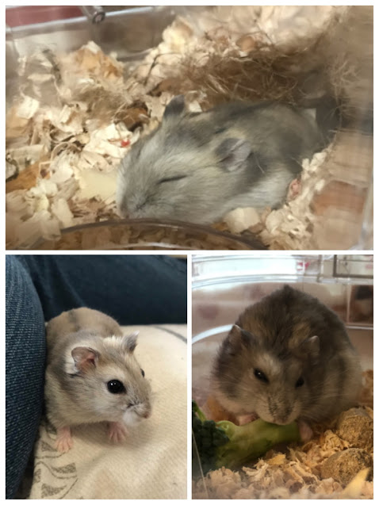

今回ハムスター編ということで、うちの子達を紹介したあとに、ハムスターの種類についてお話していこうと思います。
 
## 蒼くん
 

 
種類：　ジャンガリアン

色：　ブルーサファイア

性別：　オス
 
色が綺麗で気になり、たくさんいた中でも一番大人しい子をお迎えしました。とても大人しい性格で、寝ている体勢からでもご飯をもぐもぐしている食いしん坊です。最近、部屋んぽ（ベットの上のみ）が大好きで、よく走り回っています。
 
## お嬢
 

 
種類：　ジャンガリアン

色：　ノーマル

性別：　メス
 
ペットショップで売れ残っているのを見つけて、とても元気そうだったのでお迎えしました。とても臆病な性格で、おやつは手から食べてくれるけれど威嚇されます。下手したら噛まれます（笑）
 
 
## ハムスターについて
ハムスターは世界に24種類おり、日本でペットとして定着しているのは、ジャンガリアン・ゴールデンハムスター・ロボロフスキーハムスター・キャンベルハムスター・キンクマの5種類になります。どの種類もカラーバリエーションが豊富で個体によって性格や飼いやすさが異なるので、下調べをしてから購入することをオススメします。我が家の子たちは２匹とも”ジャンガリアン”なので、ジャンガリアンについて簡単にお話したいと思います。
 
ジャンガリアンハムスターは、小型のハムスターで、小さい体と器用に前足を動かす姿に癒されます。基本的には人慣れしてくれるので、たくさん遊んであげることもできます。もちろん個体差があるので、大人しい子もいれば、気の強い子もいるので、複数飼いするときは注意が必要です。元々臆病な性格をしているので、急に物音を立てたり、驚かせないようにしてください。寒い地域に生息しているので、体温を奪われないように足の裏には毛が生えています。カラーバリエーションが豊富で10種類ほどいると言われています。
 
 
いかがだったでしょうか。ここでは、ジャンガリアンについて少しだけ知っていただけたなら嬉しいです。詳しく知りたい・他の種類も気になるという方は、次回以降書いていきたいと思いますのでお待ちください(^^)
