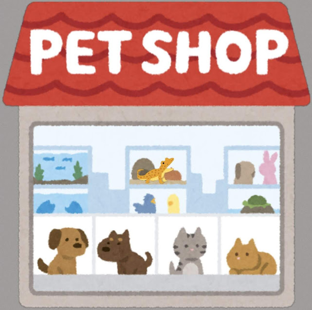
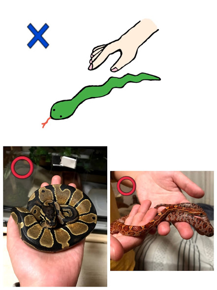

今回から、ヘビの飼い方についてお話していきます。初回はヘビの入手方法とハンドリングについてです。**初心者向け**の内容となっていますので、「知ってる！」という方はスキップしていただいて大丈夫です。

## 入手方法①　爬虫類ショップ

　ショップによって扱っている種類は変わりますが、様々な種類が豊富で、ネットでお気に入りの子を調べてから行くことができる、1番身近にお迎えできる場所です。また、専門の方がいるので飼い方について詳しく聞くことができ、購入後も相談にのってもらえることもあります。ここでは、**実際に手にとって観察することができる**ので、時間に余裕をもって行くことオススメします。お店によって異なりますが、売約が出来る場合がありますので気に入った子を逃す心配はないでしょう。更に、飼育用の備品も購入出来るのがほとんどなので最低限を揃えることは出来るでしょう。

## 入手方法②　爬虫類イベント

　イベントは、爬虫類界では一種のお祭りように賑わいます。一度に多くのショップやブリーダーが集まるので、**多くの種類やモルフを目にする**ことが出来ます。また、イベント特価で安く手に入れることもできます。ただし、多くの人で賑わうので店員さんも大忙しです。したがって、ゆっくり話すのは難しいでしょう。また、早く良い個体を見つけたもの勝ちなところもあるので、落ち着いてゆっくり見たい方はあまりオススメできません。そして、イベントでは、生体は大抵小さなケースに閉じ込められているので、全体の様子は観察できないと思ってください。もし、対面が苦手な方はさっと購入できるのでオススメです。

## 入手方法③　ペットショップ

　大型の店舗で時々取り扱われているようです。メジャーな品種を数匹だけだったり、ヘビの飼育経験者の方がいなかったりするので、あまりオススメはできません。

## 入手する前に観察すべき点
### ①口はちゃんと閉じているかどうか
　口を半開きにしている場合は、**呼吸器系の疾患**があるかもしれません。この際、ケージに白く固まった付着物があったり、ガラスに口を擦り付けるような動作が見えたら注意です。また、ずっと上を向いたままの個体も要注意が必要です。以上のような疾患は、**購入後もなりやすい病気の1つ**なので、しっかり見て聞いた方が良いです。

### ②実際に手にとってみる
　気になる個体がいれば、店員さんに許可を得て手に取らせてもらいます。手にとってチェックさせてもらう時は、常識の範囲内で**丁寧に扱うこと**が大事です。初めて飼育しようとする人は、ハンドリングも慣れていないと思うので、その旨をショップの店員さんに説明し、ハンドリングの仕方を教えてもらいながら手にとってみるようにしましょう。

### ③質問をする
　現在食べている餌の種類や大きさ、餌やりなどの間隔、餌のあげかた、食べる癖、気性は荒いかどうかなど、現場で世話を行っている人しか分からないこともあります。たいていの所では教えてくれますが、聞かなければ言うのを忘れる人もいますので聞き出しておきましょう。

## 購入して家に連れて帰るまでに注意すること
　長時間の移動は生体にとってストレスになるので、できるだけ寄り道をせずに帰りましょう。寒い時期だとカイロのような簡易保温材を貼り付けてもらえますが、暑い時期は冬以上に気をつけましょう。くれぐれも直射日光に当たらないように注意が必要です。体温調整が自分ではできない爬虫類だということを忘れずにさっさと帰るようにしましょう。

## ハンドリングの注意点
　日々のお世話や掃除などで移動させるためにハンドリングは不可欠です。また、定期的にハンドリングすることによって状態が確認できるし、特に、病気を患ったときにハンドリングを慣らしておくと診てもらいやすいです。

　基本的なハンドリングの方法としては、真正面から掴むのではなく、手のひらに乗せるようにしてそっとヘビが安定するように両手で持ち上げることです。ヘビは頭と尻尾を摘まれるのが１番嫌うので、頭とは後ろの方向から手のひらを差し込んで平行に持ち上げるのがコツです。また、バランスが崩れるのを嫌がるので両手を使うようにしましょう。噛まれるのが怖ければ、革手袋を購入すると安心です。

## 噛み付く行為について
　ハンドリングの際に不安になるのが噛まれないかということですが、どんなに大人しい個体でも**100％噛まないと言える個体はいません**。ただ、ヘビが噛むのには２通りの理由があります。
１つは、**恐怖からの攻撃**です。ヘビは手や足、声など表現を出すことができないので、噛むことで表現するしかありません。ただし、これは見慣れない人の手から自分を守るための恐怖からの防御攻撃なので、習慣づけていくと攻撃を止めてくれることが多いです。（個体の性格差にもよります）

もう１つの理由が、**餌と間違えて手に噛み付く行為**です。基本的にヘビは視覚ではなく、ピット器官で餌の熱または匂いで餌を認識します。餌のほうが冷たく、人の手が温かければ、人の手と餌を間違える場合があります。これを避けるために長いピンセットを使い、温かい餌を口の近くまで持っていくことである程度は噛まれることを防げます。

万が一、手に噛みつかれても無理やり剥がそうとすると牙にひっかかり余計に傷が広がるかもしれません。ヘビは本能的に餌を捕ることに命がけなので、ちょっとやそっとでは放そうとしません。慌てて引っ張ったりすると逃さないように更に咥えて巻き付いてしまいます。血は少し流れるでしょうが、しばらく耐えていれば間違いに気づき放してくれます。しかし限度もあるので最悪、流れる水に頭の部分を当てるとあっさり放してくれます。ただし冬場の冷たい水はあまり掛けないほうが良いので、噛まれないように気をつけましょう。もし噛まれたのであれば、菌が入らないように消毒をきちんとしましょう。

いかがだったでしょうか。ヘビの入手方法として私個人の意見としては、爬虫類のイベントで色々な種類のヘビを見てみて、気になった個体を把握します。そして爬虫類ショップで説明を聞き、納得できた子をお迎えするのが良い方法ではないかと思います。もしくは、複数の爬虫類ショップに行って１番納得できる子をお迎えするのが良いと思います。今は	TwitterやInstagramなどSNSで名前を検索すると、色々な方が写真を載せていますので、そこから調べてみても良いかもしれません。
