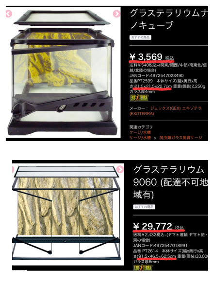
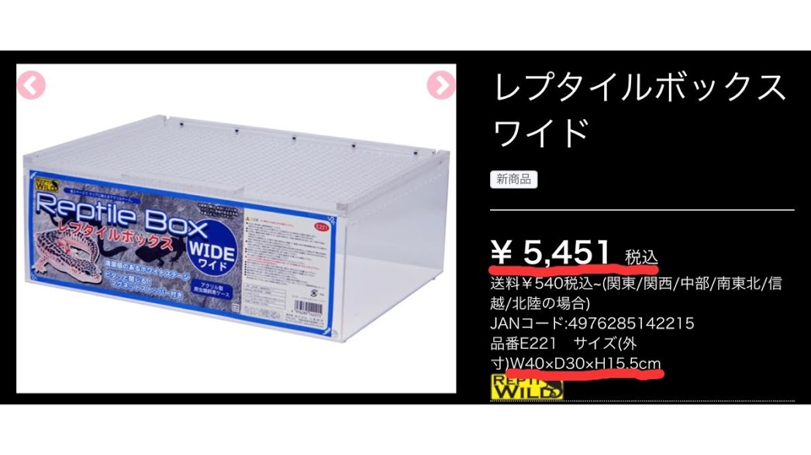
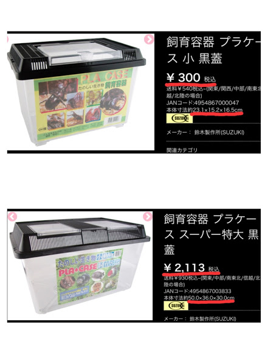
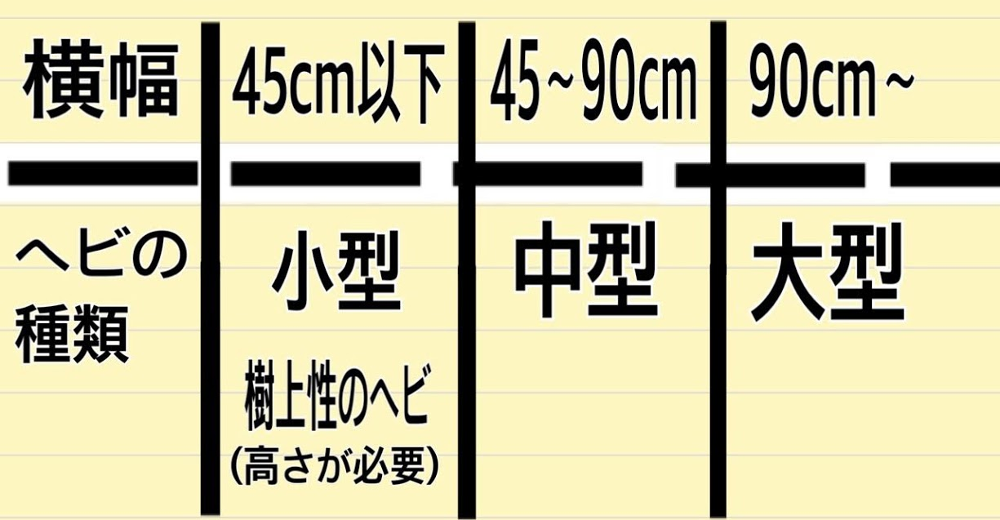

前回はヘビの入手方法を紹介しましたので、今回は飼育設備を整えるのに必要不可欠な、飼育ケージについてご紹介します。（あくまでも私個人の経験に基づいた意見ですので、必ずしもこれが絶対というわけではありません。参考程度に見ていただけたらとおもいます。）
 
## 飼育ケージ
ヘビをお迎えするに当たって、まず１番最初に探すのが飼育ケージになります。しかし、大きさや種類も様々で何を選べば良いか難しいですよね。探すポイントとしては、**素材（価格）・サイズ・使いやすさ**を基準に見ていくと良いと思います。正直な所、どれも間違いではないので私のオススメ順に紹介していきます。
 
## ケージの素材
### ①ガラスケージ
通気性が良い。保温器具なども設置しやすい。**使い勝手が良い**。
扉が側面についているので、側面から手を入れてメンテナンスをすることができる。
（なぜ側面が良いかと言うと、ヘビの天敵は鳥なので上から触られることを嫌います。そのため側面からのほうがストレスを与えずに飼育をすることが出来るのです。）
ガラスなので見栄えが良く、大型のサイズもある。
 

  
逆に、重量があるので丸洗いが面倒で、追加の加工が難しい。小型サイズのものがない。値段がサイズに比例して**高価**になる。
 
### ②アクリルケージ
ガラス素材とプラスチック素材の中間的なケージ。値段も中間。
中が観察しやすい。**軽いのでメンテナンスがしやすい**。
 

 
ガラスに比べて、保温性が低く暖突が使えない。蓋は上部がスライド式で鍵はなく、マグネット式なので脱走に注意。
 
### ③プラスチックケース
小型のヘビであれば問題なく飼育ができる。値段は**安価**。
物によるが、餌やり用の小窓がついているので給餌がしやすい。
重ねて置くことができる。暖突の取り付けができる。
**軽量なので丸洗いができる**。追加の加工が容易にできる。
 

  
大型のサイズがない。**安価**なので蓋の強度が弱く脱走されやすい。
 
### ④衣装ケース
ボックスタイプとチェストタイプがある。値段はサイズに関わらず**安価**。軽量で丸洗いが容易にできる。
 
**参考動画**　[https://youtu.be/6OBlxiKAlCg]
 
そのまま使うと通気性が悪いので、引き出しの前方・後方・側面にドリルなどで穴を複数ヶ所開けなけれなならない。鍵もついていないので、**脱走防止**にタンス用のロックを設置しなければいけない。半透明や色付きが多いので観察には向かない。**加工が必要**とされるので手間がかかる。
 
### ケージのサイズ
ヘビの種類によりますが理想的なのは、**横幅**がヘビの全長の２/３、**縦幅**がとぐろを巻いた時の直径1.5倍くらいのスペースが必要です。私がオススメしているガラスケージの大きさを基準に考えると、このようになります。
 

  
ちなみに、よくある書き方は「**横幅×縦幅×高さ**」の順番に書かれています。高さについては、**地表性か樹上性か**で変わるので注意してみると良いでしょう。
 
いかがだったでしょうか。人によって好みがあるので、自分で扱いやすそうなものを探して購入、もしくは自作をしてみてください。また、お迎え予算にあったものを選ぶと良いでしょう。ただし、脱走防止策は絶対にしておくようにしてください。
 
### 今回参考にさせていただいたサイトはこちらです。
 
**爬虫類ショップ ワイルドモンスター様**
 
[https://www.w-monster.com/shop/](https://www.w-monster.com/shop/)
 
**真夜中のビバリウム様**
 
[https://www.youtube.com/channel/UCKz1ZUW74PVhDIJ3rFxaHxw](https://www.youtube.com/channel/UCKz1ZUW74PVhDIJ3rFxaHxw)
