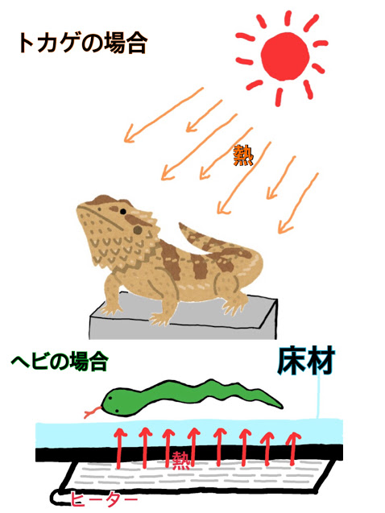
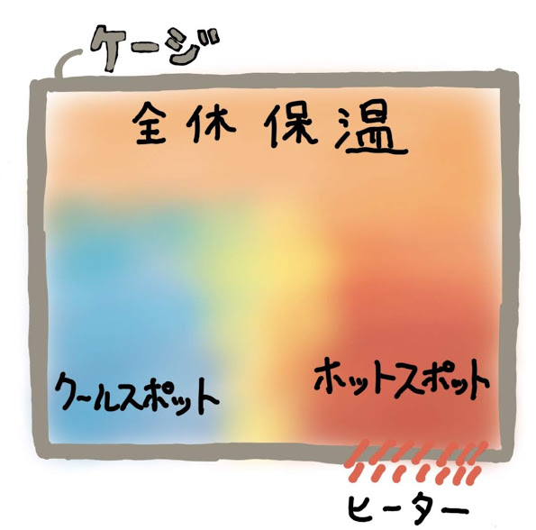
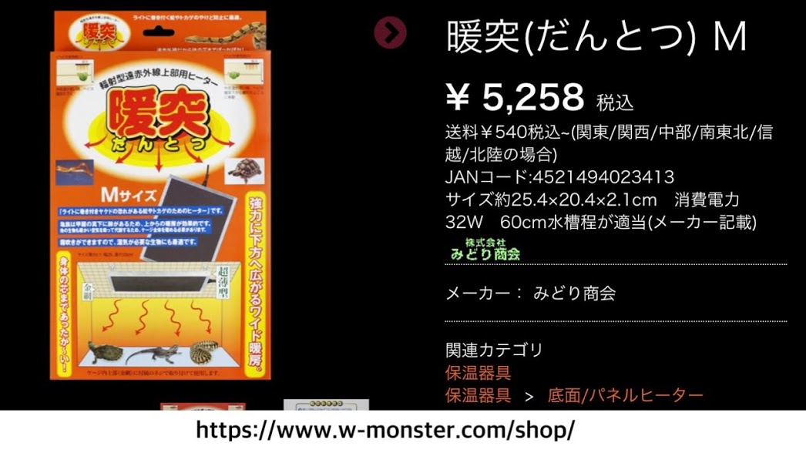
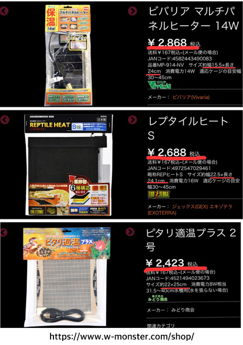
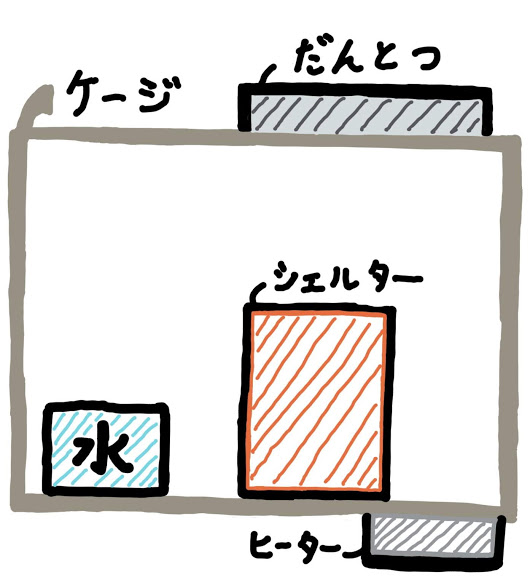
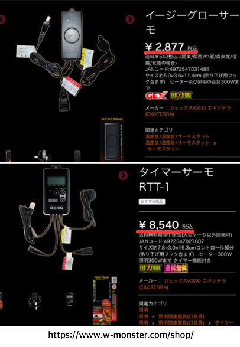

# ヘビの飼育設備（ヒーター編）
前回は飼育ケージについて紹介しましたので、今回はヒーターの種類と置き場所について話していこうと思います。
 
## 温める意味
　両爬飼育の対象になる生き物たちは、ほとんどが熱帯や亜熱帯に生息する種類なので、日本の気候はちょっとだけ寒い場合が多いのです。また、両爬たちは基本的には自分達で**体温のコントロールができない** **外温性動物**です。そのため、外からの熱によって自らの生命活動をコントロールせざるを得ません。したがって、彼らにとって最も適した温度環境を作ってあげることが目的です。
 

 
## 保温の基本用語
　両爬飼育の保温の基本は「**２種類の保温方法**」があります。１つは、ケージ内の全体を温める「**全体保温**」。もう１つは、ケージ内の一部分を温める「部分保温（**ホットスポット**）」です。この２つの保温を少なくとも昼の間は同時に行わないといけません。（夜行性の種や両生類などにはホットスポットは基本的に不要です。）
 

 
一般的には、ケージ内の温度が「高い」所と「低い」所を作り「**温度の傾斜**」ができるように保温しましょう。つまり、彼らに自分が望んでいる温度を選ばせてあげましょう。
 
全体を保温するのによく使われるのが**暖突**です。これは、上から下に向かって**空気を温める役割**があります。冬場などは特に、ヒーターだけでは温度が足りずケージ内の空気が寒くなるので、そのようなときに使用されるものです。**冬場の寒さ対策**として使われるので購入しておくことをオススメします。（エアコンで部屋全体を管理している場合は、熱すぎてしまいますので不要になります。）
 

 
ホットスポットを作るときに使われるのが**パネルヒーター**になります。これは先程の暖突と異なり、**床のある一定の範囲だけを温める役割**があります。これはヘビの大きさによって温める範囲が大きくなりますので、大きさも数種類あります。また、ヘビが消化を促す際に使うものですので、**必ず**購入しておきましょう。
 

 
## 保温するときの注意点
　せっかく保温したのに、それが原因で生き物を死なせてしまっては元も子もありません。以下は**保温時の注意事項**になります。
 
 ・エアコンなどを利用すると、思いのほか**乾燥**します。湿度のチェックは怠りのないようにしましょう。また、フィルムヒーターが敷いてある場所に飲み水などを設置すると、気づかない内に蒸発してしまうので細かくチェックしましょう。
  
 ・ケージ内に保温器具を設置する場合は、保温器具に直接生き物が触れられないようにしましょう。そのためには、ヒーターや電球の類には**火傷防止用**のカバーなどがあるので必ず利用しましょう。もちろん、飼育者も**火傷**しないように注意しましょう。（意外と熱いです）
 
 ・知らずの内に保温器具が**故障**してしまって、気づくと凍え死んでた、なんてのは洒落になりません。そのためにも、当然ですが**温度計を設置**することは忘れないようにしましょう。
 
## 器具の設置場所
　ケージの下に置くパネルヒーターの場合は、**床化面積の大体１/３くらい**の大きさが目安です。ヒーターを全面に敷き詰めてしまうと、熱いときにヘビが逃げるスペースを無くしてしまうことになります。ケージの外にヒーターを置くので、ケージが小さくても熱くなりすぎる心配もいりません。また、薄くて場所を取らないのでケージ周囲にスペースがなくても設置することができます。
以下の絵は、実際に私が、ボールパイソンのケージで置いている場所になります。あくまでも一例です。
 

 
## 温度設定
　温度調節は**自動設定**のものがオススメです。中でも、コンセントを入れるだけですぐに温まってくれるものがあり手間いらずで便利です。ほとんどの商品が温度が高くなると自動的に制御して、必要以上に温度が上がらないようにしてくれる機能がついているため、熱くなりすぎる心配もいりません。
 
 一方、温度設定ができるタイプは、自分でヘビに最適な温度を設定してあげれることが魅力です。夏場は低めに、冬場は高めに、など環境に合わせて温度を替えられるので省エネにもなります。どちらのタイプも、サーモスタットなどを使ってケージ内の温度を一定に保ってあげると、より良い環境を作れるでしょう。
 
 
 
 
いかがだったでしょうか。ヒーターは２種類あり、それぞれ役割が異なるので置き方に迷いますよね。それぞれの機能や置き方などを工夫して、ヘビにとって最適な環境をつくってあげましょう。次回は、床材についてお話したいと思います。
前回は飼育ケージについて紹介しましたので、今回はヒーターの種類と置き場所について話していこうと思います。
