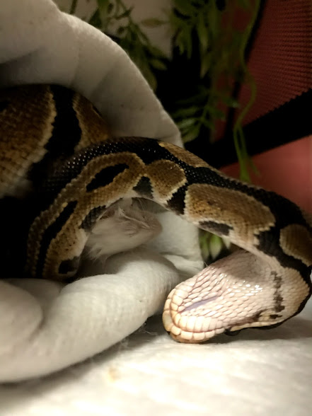
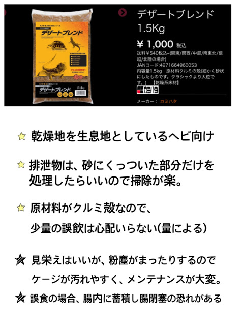
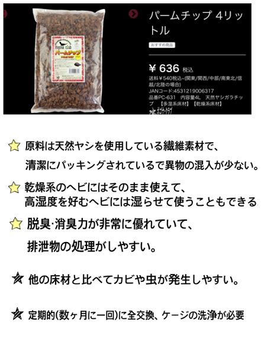
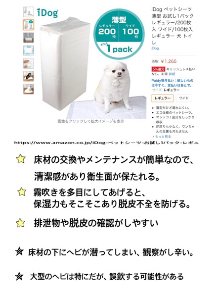

# 飼育設備（床材編）
　前回は飼育ケージについてお話しましたので、今回は床材の種類と選び方についてご紹介したいと思います。
 
## 床材を敷く意味
床材は、糞や尿酸などの排泄物を吸着して**掃除**の助けになります。そして、掃除の助けになるだけでなく、**保湿**をしたり、隠れ家としても利用できます。また、彼らは大地を這って生きているので、飼育下でも何らかの敷物はあった方が環境が良くなります。
 
## 床材選びの注意点
何よりも注意しないといけないのが**誤食**です。つまり、床材を間違えて食べてしまうことです。
 

 
上の写真は、勢いのあまりペットシートに激突したボールパイソンです。下手をするとペットシートに噛み付く可能性があります。このように、餌として勘違いしたり、餌を食べるときに一緒に食べてしまったりする**事故**は起きやすいのです。したがって、床材は「**食べられないくらい大きい**」ものにするか、「**食べてもすぐに排泄出来るくらい小さい**」ものにする必要があります。ただし、人間から見て小さいものでも、体が小さいヘビにとっては大きい場合もあります。そのため、生き物の視点に立って考えてあげましょう。特に、ピートモスなどは中に「**長い繊維**」が混じっている場合があるので注意が必要です。
 
・**砂材**などは特に気をつけるべきなのは、床材が体に接触したときに「**皮膚を傷つける**」恐れがあるということです。砂の類は見た目がサラサラでも、顕微鏡レベルではとても角ばっていたりする場合があります。
 
・床材による**気管支障害**にも注意しましょう。**ピートモス**などの微細な繊維質が鼻などから気管支に入って引っかかってしまうと言うものです。
 
・新聞紙などの**印刷物**を床材に使うこともできますが、”インク”が**体に良いと言うよりは悪い**でしょう。そのため、できれば印刷されていない部分か、少ない紙を使うのが安全であると考えられます。
 
・**黒土**もよく使われる床材ですが、畑などの園芸用からとって来るのは止めましょう。爬虫類専用と違い、農薬や化学肥料・石灰など、彼らにとって害になりやすいものが多く含まれている可能性があるからです。
 
・**水苔**は湿気を多く含むことができますが、それによってダニが湧きやすくなるので、こまめなメンテナンスが必要となります。
 
## 床材の種類
### ①砂系

### ②植物系

### ③ペットシート

 
いかがだったでしょうか。私のオススメとしては、やはり**ペットシート**です。こまめに取り替えがしやすく、清潔に保てて観察がしやすいので、**初心者向け**だと思います。今回取り上げた床材以外にも、たくさんの種類がありますが様々なメリット・デメリットがあるので、よく調べてから使うようにしてください。
 
### 今回参考にさせていただいたサイトです
**ワイルドモンスター様**
 
[https://www.w-monster.com/shop/products/list?category_id=90000](https://www.w-monster.com/shop/products/list?category_id=90000)
 
**アマゾン様**
 
[https://www.amazon.co.jp/ref=ap_frn_logo](https://www.amazon.co.jp/ref=ap_frn_logo)
