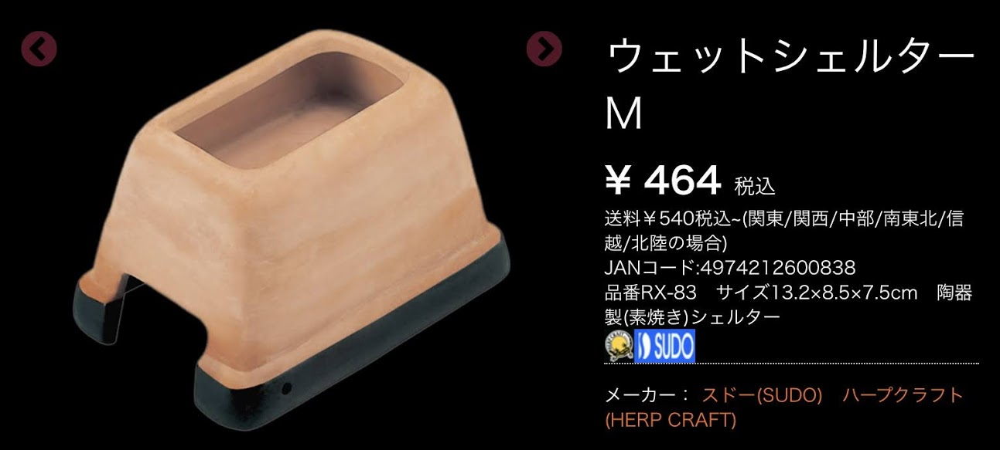

　前回は床材について紹介しました。今回は、水入れとシェルターについてお話したいと思います。これは、あくまでも私個人の経験からなる意見ですので誤りがあると思います。その際はご教授頂けると幸いです。

## 水入れの役割
　水入れの設置は**飲み水**としてだけでなく、ヘビが脱皮をするために**体全体を浸ける役割**があります。また、ケージ内の**湿度を維持**する役割も担っています。

## 水入れの注意点
+ 飼育下では比較的高い温度設定にするため、ヒーターによってかなりの水分が奪われてケージの中が**乾燥状態**になることが多いのです。乾燥状態が続いてしまうと、**脱皮不全や呼吸器系の疾患**を起こすことがあります。
+ 特に小さな個体は環境に敏感なので、**湿度を高め**に必要があります。水苔を入れたタッパーの上部に穴を開けて、飼育個体が入れるようにすると良いです。
+ 水入れは、**全身が浸れるよう**に少し高さのあるものを用意し、簡単に**ひっくり返らない**ように少し重量のあるものを選びましょう。
+ **冷たい水**は、**吐き戻しやショック死の原因**にもなるので**NG**です。常にパネルヒーターの上に置き、湿度上昇の手助けにもなるように常に常温以上にしておきましょう。

## 水入れの種類
### 飲み水だけの場合
　

### 飲み水と全身浸る役割を兼ねているもの
　

## シェルターの役割
　両生類・爬虫類に限らず、動物というのは**安息の場所**を求めるものです。それはもちろん飼育下にも適用されます。そのためシェルターは安息の場所となる役割があるのです。いわゆる**隠れ家**になりそうなシェルターは**地表性**のヘビ、隠れ家はいらないが安息の地として**とまり木**は**樹上性**のヘビといった、安息の場所はそれぞれに合ったものを用意する必要があります。ヘビは周囲の光が入ってくる、透明なアクリルやガラスといった素材のケージでは落ち着かない個体が多いので、人の視線が届かないように設置されたケージがある場合は必要ないでしょう。

## シェルター選びのポイント
　ポイントとしては、**程よく狭いこと**です。彼らは普段穴の中や石の下などに寝ていて、活動時に穴から出てきます。そのため、彼らに用意してあげるシェルターは結構狭くていいのです。ヘビは体が何かに接触している方が安心するので、変に広いと落ち着かないようです。また、ヘビは脱皮をするので綺麗に古い皮がはがれるようにザラザラした、脱皮の手がかりになるような場所や、鼻先から尻尾まで一本脱ぎをするので、最初に皮を引っ掛ける場所が必要になります。

## シェルターの種類
### 普通のシェルター

### 水飲み場も兼ねたシェルター

１番**初心者向け**の商品です。上が水入れになっており素焼きの商品なので湿度維持もできるシェルターです。サイズもS・M・Lとある程度の大きさがあり、比較的に安く手に入るの無難なものになっています。

### シェルター兼水入れに使える低コスト万能もの
## それはタッパーです！！

①お家にあるタッパーもしくは、百均で購入してきます。

②穴を開ける場所に印をつけます。

③カッターやハンダゴテで穴を開けます。このときに、切った場所でヘビが傷つかないように角を落とします。

④お水や水苔などを入れたら完成。

はい、簡単！！
100均で買える低コストで、シェルターとしても水入れとしても使える超便利品です。サイズも大きいものから小さいものまで揃えることができる優れものです。**設備費にお金をかけたくない**という方にはオススメです。

いかがだったでしょうか。**有名どころ且つ扱いやすいもの**をご紹介できたかなと思います。ちなみに、私が実際に使用しているのは、ウェットシェルターとタッパーです。この２つがあれば問題なく飼育できる自身があります。次回ご紹介するのは、温度と湿度についてです。それでは。

今回の参考サイト
[ワイルドモンスター様](https://www.w-monster.com/shop/products/list?category_id=170000)
